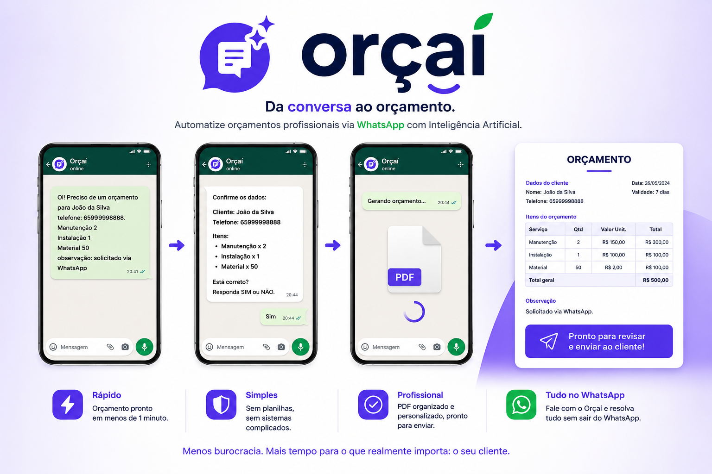

# Orçaí

<p align="center">
  
</p>

<p align="center">
  <strong>Da conversa ao orçamento.</strong><br>
  Automatize orçamentos profissionais diretamente pelo WhatsApp utilizando Inteligência Artificial.
</p>

---

## 📌 Sobre o Projeto

O Orçaí é uma plataforma SaaS que transforma conversas em orçamentos profissionais.

Em vez de abrir planilhas, documentos ou sistemas complexos, o profissional simplesmente conversa com o Orçaí pelo WhatsApp.

A Inteligência Artificial interpreta as informações, organiza os dados e gera um orçamento profissional em PDF pronto para envio ao cliente.

---

## 🚀 Como Funciona

```text
Cliente solicita um serviço
          ↓
Profissional envia as informações ao Orçaí
          ↓
IA interpreta e organiza os dados
          ↓
Orçamento profissional é gerado automaticamente
          ↓
PDF pronto para envio
```

---

## 📱 Fluxo Simplificado

1. O profissional recebe o pedido do cliente.
2. Envia as informações para o Orçaí pelo WhatsApp.
3. O Orçaí interpreta e organiza os dados.
4. A IA gera automaticamente o orçamento.
5. O PDF é entregue pronto para envio.
6. O profissional apenas revisa e encaminha ao cliente.

---

## 🎯 O Problema

Milhares de prestadores de serviço ainda utilizam processos manuais para criar orçamentos:

* Microsoft Word
* Microsoft Excel
* PowerPoint
* Bloco de notas
* Sistemas complexos e pouco intuitivos

Isso gera:

* Perda de tempo
* Erros manuais
* Atendimento lento
* Falta de padronização
* Perda de oportunidades de venda

---

## 💡 Nossa Solução

O Orçaí elimina a burocracia do processo de orçamento.

Tudo acontece dentro do WhatsApp.

✅ Sem planilhas

✅ Sem sistemas complexos

✅ Sem retrabalho

✅ Sem perder tempo

✅ Com geração automática de PDF profissional

---

## 🧠 Tecnologias

* Python
* FastAPI
* Inteligência Artificial Generativa
* WhatsApp API
* APIs REST
* Geração automática de PDF

---

## 📈 Visão de Futuro

O Orçaí é apenas o começo.

Funcionalidades planejadas:

* Assinatura digital
* CRM integrado
* Histórico de clientes
* Dashboard analítico
* Gestão financeira
* Multiusuários
* IA avançada para propostas comerciais

---

## 👩‍💻 Equipe

### Emilly Caroline Arruda

Fundadora e Desenvolvedora

### Integrantes do Projeto:

* Vitor
* Igor
* Elias
* Valderson
* Mikael
* Izabelly

---

## 📄 Licença

Projeto desenvolvido para fins acadêmicos, validação de mercado e evolução para produto comercial.

© Orçaí — Todos os direitos reservados.

